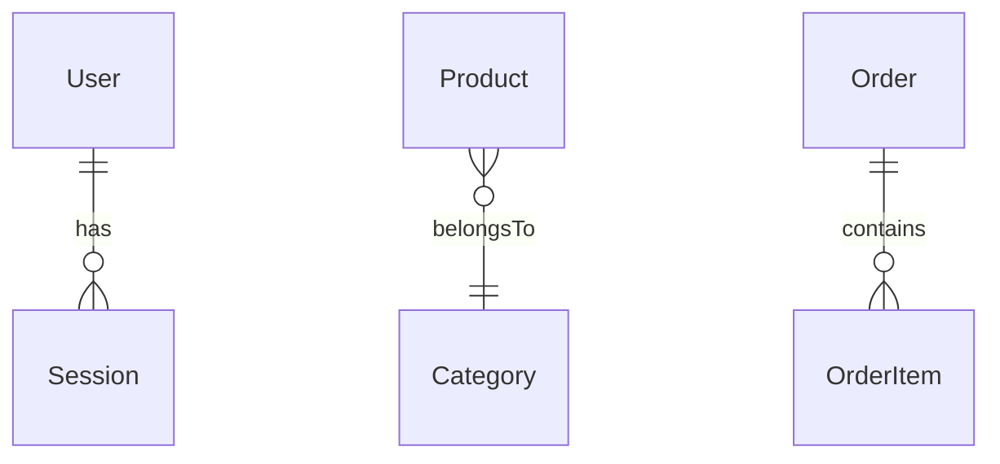
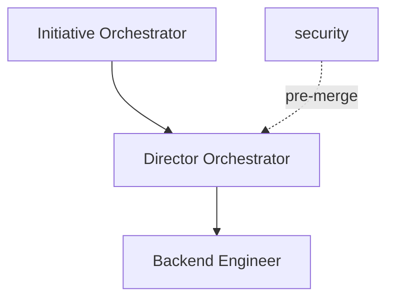

# Infrastructure Map — Generador de diagramas Mermaid

## Subcomandos

### `/infrastructure-map prisma`
1. Leer `prisma/schema.prisma` completo
2. Extraer todos los modelos y sus `@relation`
3. Agrupar por dominio: Auth, Catalog, Orders, Inventory, Delivery, CRM, Config
4. Generar Mermaid `erDiagram` agrupado por dominio
5. Guardar en `docs/diagrams/prisma-model-map.md`

### `/infrastructure-map agents`
1. Leer todos los `.md` en `.claude/agents/`
2. Extraer: nombre, skills, tools, dependencias
3. Generar Mermaid `flowchart TB` — nodos=agentes, edges=handoffs, colores por tipo (read-only vs read-write)
4. Guardar en `docs/diagrams/agent-network.md`

### `/infrastructure-map services`
1. Identificar servicios externos: Supabase (PG/Auth/Storage/Realtime), Vercel (Functions/Edge/AI/Blob), Stripe, MercadoPago, Redis/Upstash, Sentry, Groq/Anthropic/OpenAI
2. Mapear conexiones con la app
3. Generar Mermaid architecture diagram
4. Guardar en `docs/diagrams/services-map.md`

### `/infrastructure-map full`
Ejecuta prisma + agents + services → documento unificado.

## Output format

Cada subcomando genera un `.md` con:
- Titulo + fecha de generacion
- Diagrama Mermaid valido (erDiagram / flowchart / architecture)
- Agrupado por dominio (no listar 177 modelos sin estructura)

Ejemplo de relaciones Prisma:

Ejemplo de red de agentes:

## Reglas

1. **Leer el código actual** — no generar de memoria, siempre parsear schema.prisma real
2. **Agrupar por dominio** — no listar modelos sin estructura
3. **Actualizar existentes** — si ya existe el diagrama, actualizar en lugar de crear nuevo
4. **Mermaid válido** — verificar sintaxis antes de guardar
5. **Crear `docs/diagrams/` si no existe**

## Referencia

- Schema: `prisma/schema.prisma` (177 modelos)
- Agentes: `.claude/agents/` (24 agentes)
- Docs: `docs/ARCHITECTURE.md`
