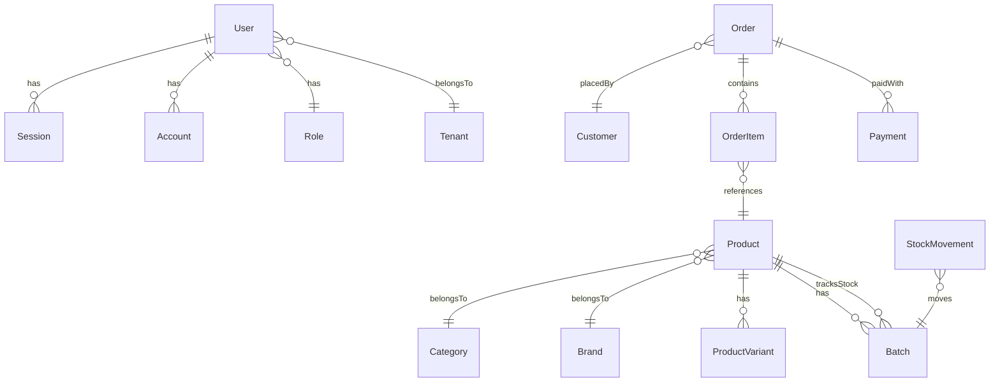
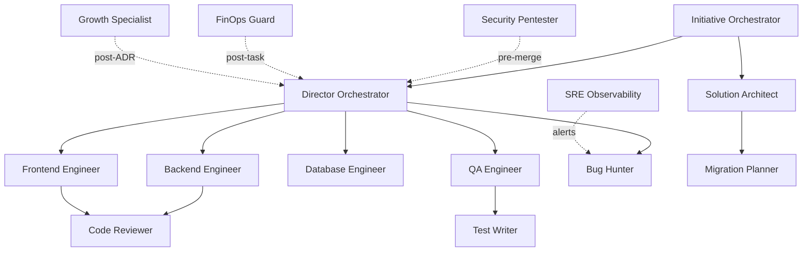

# Infrastructure Map — Generador de diagramas Mermaid

Genera diagramas actualizados de la arquitectura del proyecto.

## Subcomandos

### `/infrastructure-map prisma`

```
1. Leer prisma/schema.prisma completo
2. Extraer todos los modelos y sus relaciones (@relation)
3. Agrupar por dominio:
   - Auth (User, Session, Account, Role)
   - Catalog (Product, Category, Brand, Variant)
   - Orders (Order, OrderItem, Payment, Invoice)
   - Inventory (Batch, StockMovement, InventoryCount)
   - Delivery (DeliveryRoute, DeliveryStop)
   - CRM (Customer, Loyalty, CreditLine)
   - Config (Tenant, Store, Settings)
4. Generar diagrama Mermaid erDiagram agrupado por dominio
5. Guardar en docs/diagrams/prisma-model-map.md
```

### `/infrastructure-map agents`

```
1. Leer todos los .md en .claude/agents/
2. Extraer: nombre, skills, tools, dependencias
3. Generar diagrama Mermaid flowchart:
   - Nodos = agentes
   - Edges = handoffs (quién invoca a quién)
   - Colores por tipo (read-only vs read-write)
4. Guardar en docs/diagrams/agent-network.md
```

### `/infrastructure-map services`

```
1. Identificar servicios externos:
   - Supabase (PostgreSQL, Auth, Storage, Realtime)
   - Vercel (Functions, Edge, AI Gateway, Blob)
   - Stripe (Payments, Webhooks)
   - MercadoPago (Payments)
   - Redis/Upstash (Cache, Rate Limiting, Queues)
   - Sentry (Error Tracking)
   - Groq/Anthropic/OpenAI (LLM)
2. Mapear conexiones con la app
3. Generar diagrama Mermaid architecture
4. Guardar en docs/diagrams/services-map.md
```

### `/infrastructure-map full`

Ejecuta prisma + agents + services y genera un documento unificado.

## Ejemplo de output (Mermaid)

````markdown
## 🗺️ Infrastructure Map — Bodega San Martín

### Modelos Prisma (por dominio)



### Red de agentes


````

## Reglas

1. **Leer el código actual** — no generar de memoria, siempre parsear schema.prisma real.
2. **Agrupar por dominio** — no listar 131 modelos sin estructura.
3. **Mantener diagramas actualizados** — si ya existe, actualizar en lugar de crear nuevo.
4. **Mermaid válido** — verificar sintaxis antes de guardar.
5. **Crear directorio docs/diagrams/ si no existe.**

## Referencia

- Schema: `prisma/schema.prisma` (131 modelos)
- Agentes: `.claude/agents/` (24 agentes)
- Docs: `docs/ARCHITECTURE.md`
